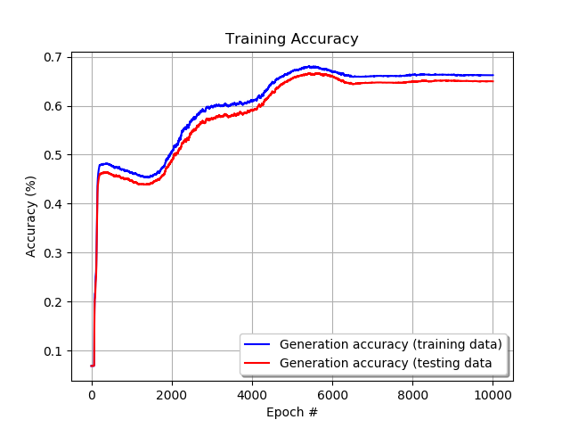

# tf-neural-net

## Overview
This is a basic implementation of a dynamic neural network Google's TensorFlow. The purpose of this project is to introduce myself to TF's data flow graphs and general best practices around python and machine learning.

## Requirements
```python
Numpy >= 1.14.0
TensorFlow >= 1.4.0
```

## Model description
This implementation leverages the GradientDescentOptimizer method for neural network model. Loss functions can be specified when triggering training. Cost functions can be defined on a layer by layer basis.

## Data
The model was tested using a promotion history data set from [keggle](https://www.kaggle.com/datasets) found [here](https://www.kaggle.com/regivm/promotion-response-and-target-datasets). Two data sets are provided; promoted.csv and target.csv. All training was done using the promoted.csv data set as it has class values.

####Features
- [ ] `customer_id (column 1)` --- unique identifier, not used in this model
- [x] `card_tenure (column 3)` --- card tenure in months
- [x] `risk_score (column 4)` --- customer risk score
- [ ] `num_promoted (column 5)` --- number of times the customer was previously promoted to, ignored as there is insufficient data
- [x] `avg_bal (column 6)` --- average customer balance
- [x] `geo_group (column 7)` --- Geographical groups: NW, W, S, E, SE
- [x] `res_type (column 8)` --- residence type: SI=single family, CO=cooperative, CN=condominium, RE=rental TO=townhouse

####Transformations
Categorical features geo_group and res_type were transformed into binary feature for each possible value using the expand_categorical_feature() method.
```python
def expand_categorical_feature(feature):
    result = []
    translation = []
    for category in np.unique(feature):
        translation.append(category)
        result.append([1 if row == category else 0 for row in feature])
    return result, translation
```
*Empty values for string based features are replaced with 'N/A'*
*Numerical features with 0 or null values are replaced by data set means*

####Labels
- [x] resp (column 2) --- binary value indicating if a customer responded to the offer

####Data extraction
The following code in the `train.py` file extracts features and performs the transformations described above:  
```python
features_numeric = d.zero_to_mean([[float(row[2].strip()) if row[2].strip() else 0.,
                     float(row[3].strip()) if row[3].strip() else 0.,
                     float(row[5].strip()) if row[5].strip() else 0.]
                    for row in data])
# normalize numeric features
features_numeric = np.transpose(d.normalize(features_numeric))

features_string = [[row[6].strip() if row[6].strip() else 'N/A',
                    row[7].strip() if row[7].strip() else 'N/A']
                   for row in data]

# expand the categorical columns into binary categories
row4_expansion, row4_translation = d.expand_categorical_feature(np.transpose(features_string)[0])
row4_expansion = row4_expansion
print('Row 4 expanded into the following categories: ' + str(row4_translation))
row5_expansion, row5_translation = d.expand_categorical_feature(np.transpose(features_string)[1])
row5_expansion = row5_expansion
print('Row 5 expanded into the following categories: ' + str(row5_translation))

# concatenate numerical data with categorical features
features = np.append(features_numeric, row4_expansion, axis=0)
features = np.append(features, row5_expansion, axis=0)
features = np.transpose(features)
```

Label data is also extracted in the `train.py` file:
```python
# extract target data
target = np.array([[float(row[1])] for row in data])
```

The data is then split into training and testing data sets:
```python
# split into test and train data sets
train_size = round(len(features) * (1 - hp.validation_size))
train_index = np.random.choice(len(features), size=train_size)
test_index = list(set(range(len(features))) - set(train_index))

# training data
train_inputs = features[train_index]
train_outputs = target[train_index]

# testing data
test_inputs = features[test_index]
test_outputs = target[test_index]
```

## File Description
* `data.py` loads data from the files specified (in the `data/` folder).
* `hyperparams.py` includes all hyper parameters.
* `network.py` defines the TensorFlow network.
* `train.py` executes training.
* `utils.py` contains helper and operational functions.

## Hyperparams
* `data_dir = 'data'` -- directory to check for data file
* `learning_rate = 0.05` -- learning rate
* `batch_size = 500` -- training batch size
* `epochs = 1000` -- number of training epochs
* `validation_size = 0.4` -- percentage of the data set to be used for validation against over-fitting
* `nn_structure = [14, 14, 14]` -- array dictating the number of neurons in each hidden layer
* `nn_activations = ['na', 'na', 'na']` -- array dictating which activation function will be used in each hidden layer (TODO: feature not yet implemented)
* `auto_balance = True` -- boolean to pass along during training to specify if the data samples need to be balanced to account for uneven class ratios (classification only)
* `loss_function = 'l2'` -- loss function to be used for training

## Training
Training is done by breaking the data into training and testing sets in order to help evaluate over-fitting. The training is then conducted over several epochs.

Because the class distribution is ~ 7:1000 the following logic was used to ensure epoch samples have even distribution across all classes:
```python
classes = np.unique(train_outputs)
for classification in classes:
    batch_index = np.append(batch_index, np.random.choice(
        np.where(train_outputs == classification)[0], int(batch_size / len(classes))))
    batch_index = batch_index.astype(int)
```

**Note:** disabling the plot parameter improves training speed drastically as loss and accuracy are calculated only 5 times during training (as opposed to at every epoch)

## Results


#### No class balancing for training data
The following hyperparams were used for training. In this training session class balancing was not used and the negative class can be seen to clearly dominate the data set.
```python
learning_rate = 0.05
batch_size = 500
epochs = 1000
validation_size = 0.4
nn_structure = [10]
auto_balance = False
loss_function = 'l2'
```

The model converges immediately on classifying everything under the negative class, establishing an accuracy of ~93%
```bash
λ python train.py
Row 4 expanded into the following categories: ['E', 'N', 'N/A', 'SE', 'W']
Row 5 expanded into the following categories: ['CN', 'CO', 'N/A', 'RE', 'SI', 'TO']
Epoch #200 of 1000
Training data loss:  0.07037832
Training data accuracy:  0.93133336
Epoch #400 of 1000
Training data loss:  0.066763625
Training data accuracy:  0.93133336
Epoch #600 of 1000
Training data loss:  0.066057175
Training data accuracy:  0.93133336
Epoch #800 of 1000
Training data loss:  0.06577557
Training data accuracy:  0.93133336
Epoch #1000 of 1000
Training data loss:  0.06565612
Training data accuracy:  0.93133336
```
Loss function cost


Accuracy


#### Implementation of class balancing
The following hyperparams were used for training. Class balancing was used in this training session.
```python
learning_rate = 0.05
batch_size = 500
epochs = 1000
validation_size = 0.4
nn_structure = [10]
auto_balance = True
loss_function = 'l2'
```

The model attains a maximum classification accuracy of ~52%, which is not much better than random classification. 
```bash
λ python train.py
Row 4 expanded into the following categories: ['E', 'N', 'N/A', 'SE', 'W']
Row 5 expanded into the following categories: ['CN', 'CO', 'N/A', 'RE', 'SI', 'TO']
Epoch #200 of 1000
Training data loss:  0.27328444
Training data accuracy:  0.4766
Epoch #400 of 1000
Training data loss:  0.26482427
Training data accuracy:  0.51213336
Epoch #600 of 1000
Training data loss:  0.2577478
Training data accuracy:  0.48686665
Epoch #800 of 1000
Training data loss:  0.2552198
Training data accuracy:  0.44946668
Epoch #1000 of 1000
Training data loss:  0.25249058
Training data accuracy:  0.475
```
Loss function cost


Accuracy


Increasing the numbers of epochs by a factor of 10 results in a slightly better maximum accuracy of ~56%

Loss function cost


Accuracy

```bash
Epoch #10000 of 10000
Training data loss:  0.23636797
Training data accuracy:  0.55
```

Further increasing the batch size to 1000 further increases the model's performance to a maximum of ~64% and results in a much more stable model.

Loss function cost


Accuracy

```bash
Epoch #10000 of 10000
Training data loss:  0.23636797
Training data accuracy:  0.55
```

Although increasing the number of neurons in the hidden layer has no impact on performance, adding a hidden layer (`nn_structure = [10, 10]`) further boosts performance to a maximum of ~68%


Loss function cost


Accuracy

```bash
Epoch #10000 of 10000
Training data loss:  0.23361777
Training data accuracy:  0.66253334
```